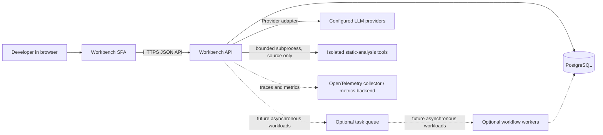
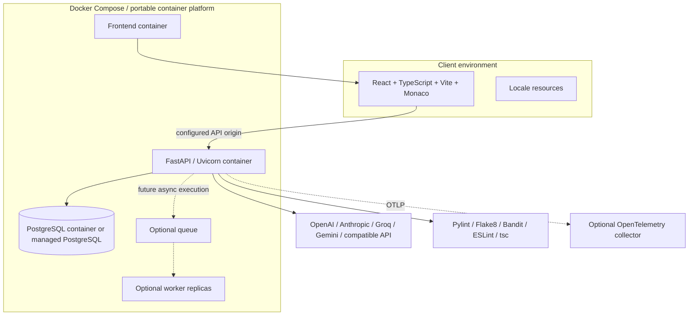
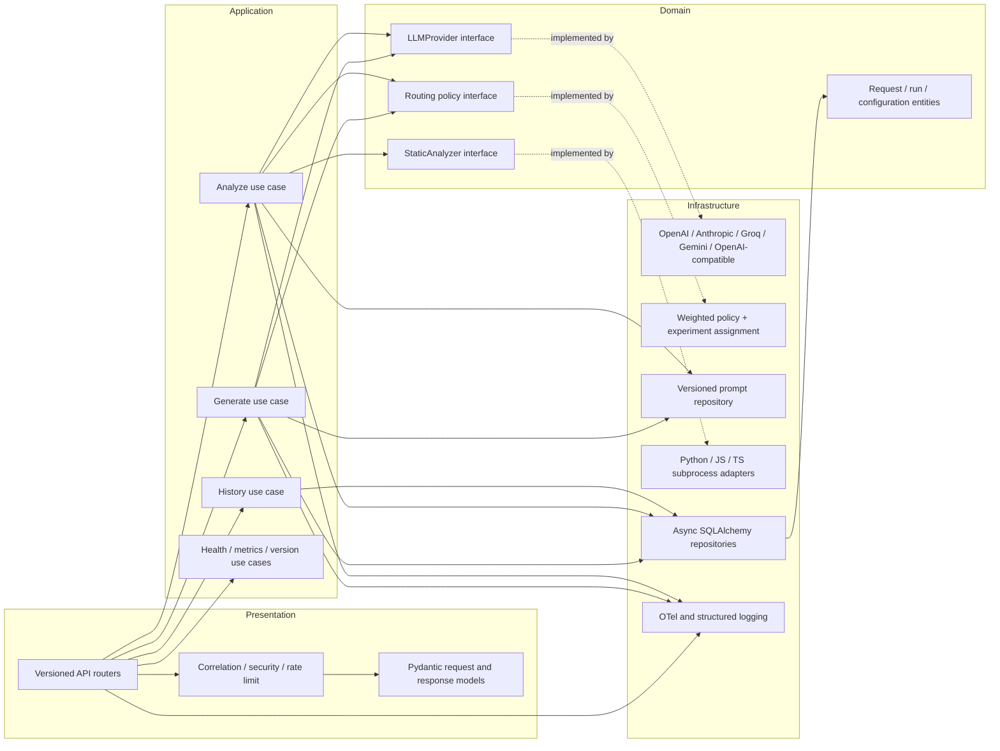
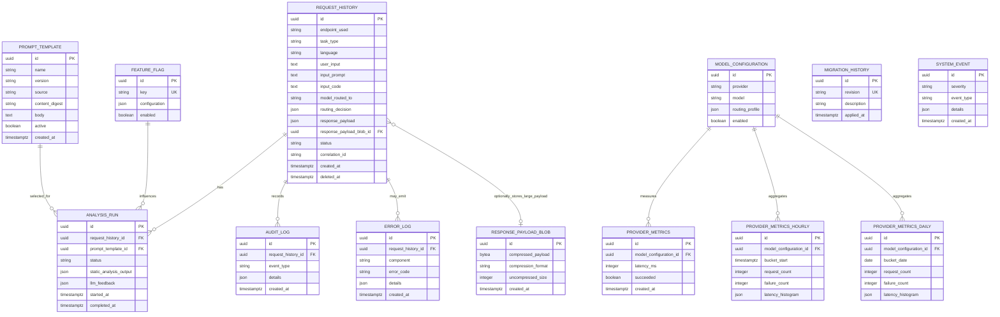
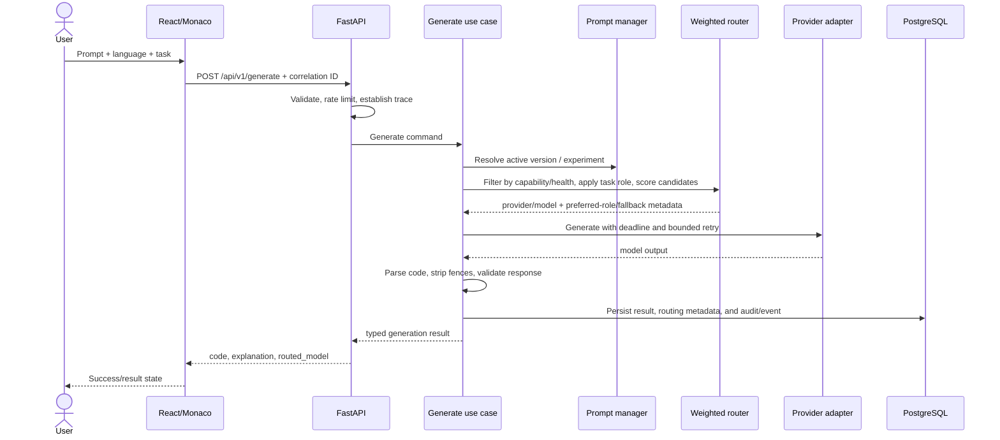
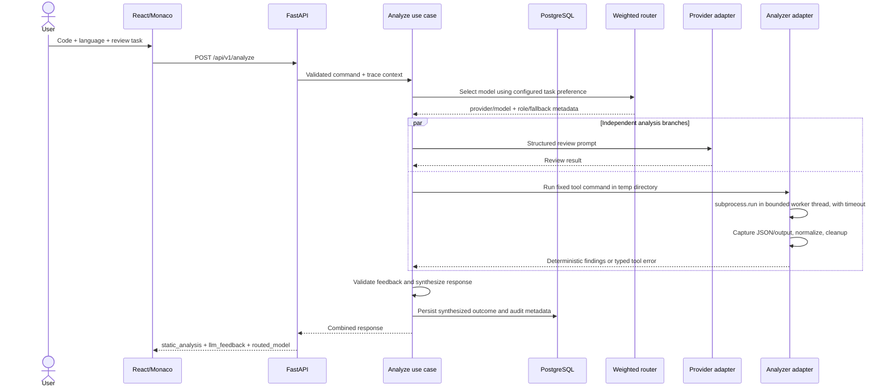
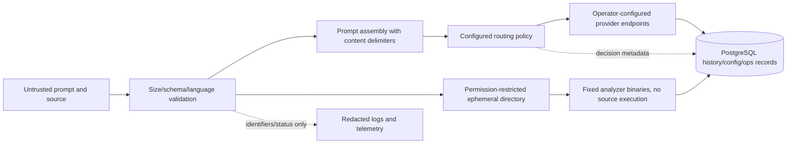
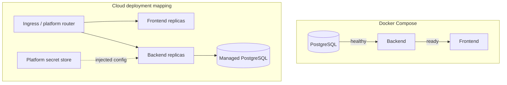

# Architecture

## System context (C4: Level 1)

The user-facing system consists of a browser SPA and a stateless API. PostgreSQL stores product history and operational records. LLM providers and analyzer binaries are external execution boundaries. Telemetry is optional infrastructure: an unavailable exporter must not block user requests. V1 uses synchronous HTTP requests, but independent analysis branches run concurrently; a durable task queue is a documented extension, not a current dependency.

## Container view (C4: Level 2)

The frontend and API are independently deployable. Compose supplies local PostgreSQL; cloud environments can substitute managed PostgreSQL and secret/telemetry services without changing application layers.

## Backend component view (C4: Level 3)

### Why each component exists

- **Presentation** owns HTTP paths, request validation, response contracts, middleware, and HTTP error mapping. It contains no routing or provider policy.
- **Application** coordinates workflows and transactions while depending on domain interfaces.
- **Domain** defines stable concepts and ports: provider, router, analyzer, repository, prompt source, and routing signals.
- **Infrastructure** adapts SQLAlchemy/PostgreSQL, provider SDKs or HTTP APIs, prompt/config resources, subprocess tools, and telemetry to those ports.
- **Shared** contains cross-cutting configuration loading, error types, correlation context, and serialization primitives without becoming a dumping ground.
- **Frontend** keeps editor state and API interaction separate; locale resources hold UI copy, and API origin is deployment configuration.

## Data model

All application-record primary identifiers are UUIDs. Foreign keys preserve lifecycle relationships. `request_history` is indexed by `(created_at DESC, id DESC)` for bounded keyset pagination and by endpoint/task; operational time-series tables receive retention/aggregation policies. Prompt name/version is unique. Soft deletion applies only to user-visible history; append-only audit and system events use retention rather than soft-delete semantics. `MigrationHistory` is an application audit projection with a UUID primary key and unique Alembic revision string; Alembic's required version table remains migration-tool metadata rather than a domain entity.

`RequestHistory` stores the contract fields plus separate prompt/code fields, routing signals, correlation ID, status, and timestamps. The API's `user_input` is a concise contract representation; avoid duplicating large code in multiple tables. Full response payloads are stored for history, while logs/metrics omit source and prompt text. Enforce configurable `max_response_size_bytes` before persistence. PostgreSQL native TOAST compression is the default; payloads exceeding configurable `response_compression_threshold_bytes` are serialized and compressed into `ResponsePayloadBlob`, with a UUID reference and format/size metadata in the request row. History reads transparently rehydrate the original JSON contract. Set separate input, output, and decompressed response limits to avoid compression bombs.

## Request lifecycle: generation

## Request lifecycle: analysis and synthesis

The HTTP request remains open until both branches finish. Analyzer commands are fixed configuration-owned argument arrays (never shell strings); a semaphore bounds concurrent analysis work, and a small dedicated worker pool keeps blocking process waits off the API event loop. The provider call has its own bounded concurrency and retry policy. A future queue can move these same application operations to durable workers when request deadlines or throughput require it.

Routing preferences are operator configuration in `settings.yaml`: each provider receives a `fast` or `reasoning` role and each task maps to its preferred role. Language is an open, validated label rather than a fixed enum; provider capability `*` means the provider can be asked to generate/review any language, while explicit per-provider language sets can still narrow eligibility. Capability, credential, and health filtering happens first. If preferred-role candidates remain, weighted scoring chooses among them; otherwise the router selects from the eligible fallback set and persists `preferred_role` and `role_fallback`. The role labels do not hardcode model IDs or imply that a provider credential/model is configured.

The editor's language suggestion list and native mode resolver both use Monaco's registered language definitions. Unrecognized labels remain available to the provider but use Monaco's plaintext mode and a neutral `.txt` tab name. Static-analysis capability is intentionally independent of provider language capability: only configured Python, JavaScript, and TypeScript tools run today. For all other labels the AI review still runs and `analysis_errors` explains that deterministic analysis is unavailable.

## Data flow and trust boundaries

The browser is outside the backend trust boundary. Prompts/code remain untrusted after schema validation. The provider boundary receives only user content and selected prompt; provider responses are also untrusted and schema-validated. Analyzer subprocesses receive source files in fresh temporary directories and fixed arguments; user-controlled source is parsed but never run. Database access is restricted to the backend. Telemetry exporters receive redacted metadata.

## Security boundary and controls

- **Browser/API:** CSP, HSTS in TLS deployments, `X-Content-Type-Options`, frame/referrer protections, strict CORS allowlist, request size limits, schema validation, IP-based rate limiting, and output rendered as text/escaped Markdown with raw HTML disabled.
- **API/provider egress:** credentials from secret environment/mounted secret files; TLS; fixed provider adapters; configurable endpoint allowlist; reject loopback, link-local, private, and cloud metadata destinations for configurable URLs unless an explicit operator setting permits local Ollama; bound redirects and response sizes.
- **Prompt injection:** label prompt and code as untrusted input, use task-specific policy prompts, do not expose tools/secrets to the model, validate output structure, and never execute model output.
- **Analyzer subprocess:** no shell, fixed executable/arguments, non-root API process, sanitized environment, per-request temporary directory with restrictive permissions, configured timeout and output normalization limit, and unconditional cleanup. The subprocess inherits the API container's network namespace; it does not receive user-supplied executable arguments and submitted source is never executed. Container CPU/memory limits bound aggregate analyzer resource use.
- **Database:** least-privilege account, parameterized SQL through SQLAlchemy, schema migrations, connection TLS where remote, and no provider secrets in tables.
- **CSRF/cookies:** this version uses no authentication cookies. If a deployment later adds cookies, enable SameSite/Secure/HttpOnly and CSRF tokens for state-changing requests.

## Configuration and prompt management

Runtime values resolve from environment variables and validated configuration files. `.env.example` documents names only; it contains no usable credentials. `settings.yaml` and `config/` hold non-secret defaults. `feature-flags/` holds experiment and rollout definitions. Prompt lifecycle has an explicit precedence and ownership model:

1. **Git source of truth:** `prompts/` contains authored, reviewed, versioned baseline templates (`generation.yaml`, `review.yaml`, `security.yaml`, `refactor.yaml`, `translation.yaml`, `testing.yaml`, and `documentation.yaml`).
2. **Runtime override:** mounted `prompt-templates/overrides/` may replace a baseline by name/version and must include a content digest and source version; it is read-only to the app process.
3. **Database activation/history:** `PromptTemplate` stores immutable activated snapshots, active-version pointers, experiment metadata, and audit history. Operators activate reviewed Git versions through a controlled administrative workflow; the API loads active snapshots at startup and does not silently rewrite the Git baseline.
4. **Emergency rollback:** `prompt-templates/rollback.yaml` pins exact known-good template versions/digests and takes precedence over runtime override and database selection until removed by an operator.

Prompt bodies are not embedded in route or use-case code. Every resolved prompt records its source, version, digest, and experiment in the analysis/request record.

The deployment config supplies frontend API origin, bind/container ports, database URL, CORS origins, request and process limits, telemetry endpoint, provider endpoints/model IDs, weights, health thresholds, and retry policy. API path strings are fixed contract identifiers. UI strings are loaded from locale resources. Configuration is validated at process startup, but missing provider credentials disable only that provider rather than the entire application.

Response caching is **disabled by default**. Generation remains nondeterministic and inputs may contain sensitive source. If an operator explicitly enables a future cache, it must use a configured TTL and size limit, include provider/model, prompt digest, task, language, all request options, and tenant/workspace scope in the key, and provide an opt-out for sensitive requests. Cache hits must be observable and must not bypass authorization or request-history policy.

## Routing policy

1. Estimate input/output tokens and prompt complexity from bounded, deterministic features.
2. Filter models that do not support the language/task, exceed latency target, lack credentials, or are unhealthy.
3. Score eligible candidates using normalized quality capability, task affinity, cost, latency, health, and configured preference weights. The score formula and weights are configuration-driven.
4. Apply deterministic experiment assignment and canary eligibility, then select the highest weighted score with a stable tie-breaker.
5. Persist chosen provider/model, feature snapshot, policy version, experiment, and reason codes. Never return secrets or raw credentials.

Routing is behind a domain interface so a later learned policy can replace scoring. Health uses rolling outcomes with bounded windows and hysteresis to avoid route flapping. Provider calls use per-provider concurrency limits, deadlines, and retries only for retryable failures. Failures return typed errors mapped to 502/503/504.

## Failure handling and consistency

- Create a pending request/run record before external work; use terminal success, partial, or failure status and persist a correlation ID.
- Run analysis and AI review concurrently. If one branch fails, preserve the successful branch and return an explicit typed branch error; if the required provider call fails, return a structured upstream HTTP error and persist the failure.
- Use bounded retries with exponential backoff and jitter for 429 and transient 5xx/network errors; honor `Retry-After` within the request deadline. Do not retry validation/auth failures.
- Analyzer nonzero exit is expected and parsed as findings. Missing binary, timeout, malformed output, or output overflow is a typed analyzer failure, never an empty-success result.
- Keep database transactions short; do not hold a transaction open across provider/subprocess work. A process crash can leave a pending row; a periodic reconciliation task marks old pending records failed.
- Telemetry, metrics export, and event recording are best-effort and cannot mask the primary result. Persist required request history with its response transaction.

## Asynchronous execution extension path

V1 runs generate/analyze inline over HTTP with strict end-to-end deadlines and bounded concurrency. Keep the workflow boundary replaceable: route handlers create a validated command; an application-level `WorkflowDispatcher` accepts it and returns either a completed result (the v1 inline dispatcher) or a durable job receipt. The use case itself is independent of FastAPI and queue implementation. For workloads that exceed the HTTP deadline or require retries beyond one request, add a queue adapter (Celery, Dramatiq, RQ, or Temporal) and worker deployment; workers call the same application use cases and repository/provider/analyzer ports. Persist job state and idempotency key before acknowledging enqueue, use an outbox or transactional enqueue pattern to avoid losing accepted work, and expose `GET /api/v1/jobs/{id}` plus cancellation only when async mode is enabled. Queue depth, oldest-job age, retries, dead-letter count, and worker saturation become health/metrics signals. The queue is optional in V1 and not part of the Compose startup dependency.

## Provider metric aggregation and retention

`ProviderMetrics` is a raw event table with a short configurable retention window. A scheduled, idempotent aggregation job upserts fixed UTC buckets into `ProviderMetricsHourly`; daily rollups are derived from raw/hourly data into `ProviderMetricsDaily`. Store count, success/failure count, and mergeable latency histogram buckets (so percentiles can be computed consistently) rather than averaging percentiles. Aggregate before raw deletion, verify the raw watermark, and use unique keys `(model_configuration_id, bucket_start)` / `(model_configuration_id, bucket_date)` for retry safety. Retain hourly rows for a configurable operational window and daily rows for a longer reporting window. Partition or expire raw rows by time when volume warrants it; do not retain one row per request indefinitely.

## Scaling and cost strategy

- Scale stateless API and frontend replicas independently; keep no session state in process memory. Use managed PostgreSQL or a separately scaled database with pool limits.
- Bound database pool, API concurrency, analyzer concurrency, per-provider concurrency, request size, output size, and call deadlines via configuration.
- Route low-complexity/high-volume tasks to lower-cost models; reserve reasoning models for high-complexity/security tasks and latency/capability constraints.
- Use token budgets, prompt versioning, provider health, cached static configuration, and bounded retries to control spend. Do not cache user code/results by default because code may be sensitive and outputs can be nondeterministic.
- Configure maximum response bytes and a compression threshold; the application enforces limits before writing JSONB or compressed payload blobs and before rehydrating history responses.
- Retain provider metrics and operational event data on configurable retention schedules; aggregate old metrics before deletion.

## Deployment topology

Compose uses a PostgreSQL health check, backend migration/readiness gating, and frontend health check. ECS/Kubernetes use equivalent health/readiness probes and a managed database/secrets store; Railway, Render, and Fly.io map the same environment/config contract to their service definitions. Migration execution is a one-shot release step in scaled deployments, not a migration race in every replica.

CI also performs dependency vulnerability scanning and emits an SBOM for backend and frontend/container artifacts. The SBOM is retained as a build artifact and scanned with a configured vulnerability database; critical/high findings fail the pipeline according to the repository's policy.

## Architecture self-review: three passes

### Review 1 — single points of failure and hardcoding

- **Finding:** PostgreSQL is the authoritative history store and therefore a stateful availability dependency. **Resolution:** health/readiness separation, short transactions, managed PostgreSQL option, backups, and graceful 503 behavior when persistence is unavailable. Do not claim zero downtime without database HA.
- **Finding:** a fixed default provider could hardwire routing. **Resolution:** provider registry/model catalog/weights/endpoints are configuration; unavailable providers are excluded dynamically.
- **Finding:** API contract paths are fixed by specification. **Resolution:** treat paths as versioned interface identifiers; deployment origins and bind ports remain configuration.

### Review 2 — replaceability and cloud neutrality

- **Finding:** provider SDK response formats could leak into application services. **Resolution:** normalize through `LLMProvider` and typed domain responses; adapters own provider-specific errors and payloads.
- **Finding:** database ORM types or subprocess details could leak into domain policy. **Resolution:** repositories and analyzer ports isolate SQLAlchemy and tool binaries.
- **Finding:** Compose-specific service names could leak into code. **Resolution:** database/provider/telemetry addresses are injected configuration; manifests only map platform configuration.

### Review 3 — security, operational failure, and over-design

- **Finding:** temporary source files and subprocesses are high-risk boundaries. **Resolution:** no code execution, fixed analyzer invocations, configured timeout, container CPU/memory limits, restrictive permissions, and guaranteed cleanup. The analyzer inherits API-container network access; dedicated network isolation would require a separate analyzer service/container.
- **Finding:** optional providers, analyzers, and telemetry can fail independently. **Resolution:** typed health state and error outcomes; telemetry is best-effort; partial analyzer results stay explicit.
- **Finding:** the requested tables can grow without bounds. **Resolution:** indexed pagination and configurable retention/aggregation for operational metrics/events.
- **Finding:** speculative authentication and distributed queueing would expand the scope without a requirement. **Resolution:** single shared workspace and synchronous bounded workflows; add queues only if observed latency/volume justifies them.

All three passes found tradeoffs but no unresolved architecture issue that prevents the requested first implementation. The architecture accepts PostgreSQL as the durable system-of-record dependency and makes its operational availability explicit.
